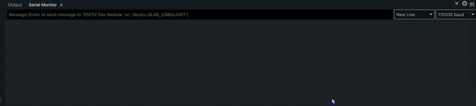
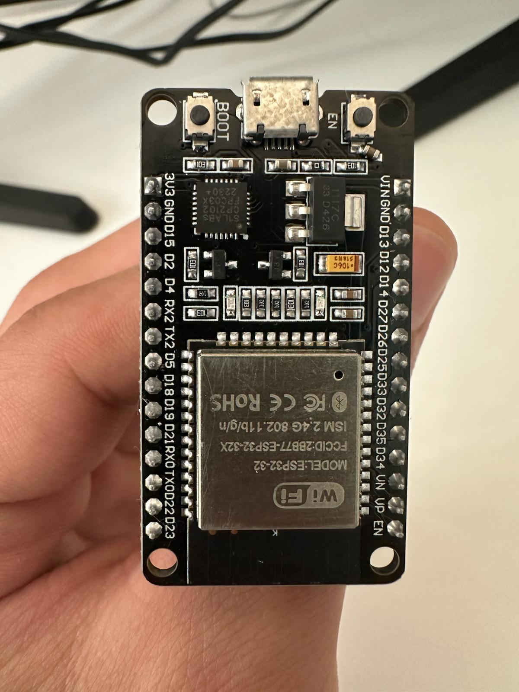
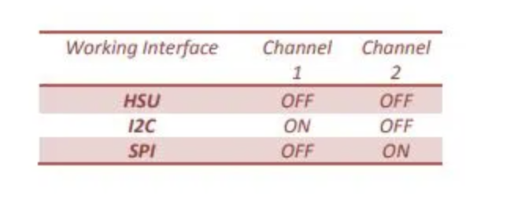
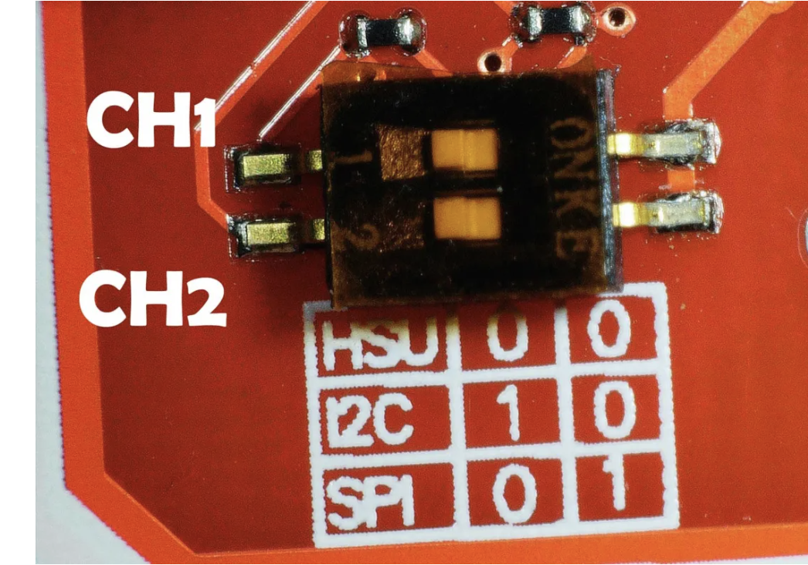

# ESP32-PN532-NFC-RFID-Card-Reader

A simple project using the ESP32 and PN532 module to read 13.56MHz RFID cards/tags.  
Supports reading UID and basic block data from MIFARE 1K cards.

---

## Preview

Every time you tap a card or key fob to the PN532 Module, its UID is detected in the Arduino Serial Monitor.



---

## 🛠 Hardware Used

| Component         | Model / Details                |
|-------------------|-------------------------------|
| Microcontroller   | ESP32 DevKit (NodeMCU-style)  |
| NFC Module        | PN532 (I2C/SPI/HSU compatible)|
| Cables            | Jumper wires                  |
| RFID Cards        | Standard MIFARE 1K            |




---

## 🧩 Wiring (I2C Mode)

```
   +-------------+        +--------------+
   |   ESP32     |        |   PN532      |
   |             |        |              |
   |   VIN/5V ---+--------+ VCC          |
   |   GND ------+--------+ GND          |
   |  GPIO21 ----+--------+ SDA          |
   |  GPIO22 ----+--------+ SCL          |
   +-------------+        +--------------+
```

Make sure the I2C interface is turned on:  


below are the interface channels.



---

## 💻 Software & Libraries

- **Arduino IDE** (v1.8+ or Arduino CLI)
- **Adafruit PN532 library**  
  Install via Arduino Library Manager:  
  `Sketch > Include Library > Manage Libraries...` and search for "Adafruit PN532".

---

## 🚀 Getting Started

1. **Clone or Download this repository**
2. **Wire your hardware as shown above**
3. **Open the Arduino IDE**
4. **Install the Adafruit PN532 library**
5. **Copy the example code below into a new sketch**
6. **Select your ESP32 board and correct COM port**
7. **Upload the sketch**

---

## 📄 Example Code

```cpp
#include <Wire.h>
#include <Adafruit_PN532.h>

#define SDA_PIN 21
#define SCL_PIN 22

Adafruit_PN532 nfc(SDA_PIN, SCL_PIN);

void setup() {
  Serial.begin(115200);
  nfc.begin();
  uint32_t versiondata = nfc.getFirmwareVersion();
  if (!versiondata) {
    Serial.println("Didn't find PN53x board");
    while (1);
  }
  nfc.SAMConfig();
  Serial.println("Scan a card to display UID...");
}

void loop() {
  uint8_t uid[7], uidLength;
  if (nfc.readPassiveTargetID(PN532_MIFARE_ISO14443A, uid, &uidLength)) {
    Serial.print("Card UID: ");
    for (uint8_t i = 0; i < uidLength; i++) {
      Serial.print(" 0x"); Serial.print(uid[i], HEX);
    }
    Serial.println();
    delay(1500);
  }
}
```
---

## 🧑‍🔧 Troubleshooting

- **UID writing fails on Magic cards?**  
  Make sure your PN532 is in the correct interface mode (SPI/I2C).

- **Garbled serial output?**  
  Double-check baud rate in Serial Monitor (should match `Serial.begin()`).

- **Nothing detected?**  
  Confirm wiring, and that you’re using the right pins for I2C/SPI.

---
## 📝 Lessons Learned

- **Microcontroller Integration:**  
    Learned end-to-end process of setting up, wiring, and programming an ESP32/Arduino with a PN532 NFC module.

- **NFC/RFID Card Operation:**  
  Learned how to read and interpret card UIDs, block data, and the basics of RFID/NFC technology.

- **Hardware Debugging:**  
  Gained practical troubleshooting experience—solving issues with wiring, power, and interface selection (I2C vs. SPI).

- **Signal Detection & Data Processing:**  
  Successfully detected and displayed unique identifiers from various cards using real hardware.

- **Practical Security Insight:**  
  Understood the limitations and risks of UID-based access control, and the value of “magic” cards in testing system security.

- **Project Documentation:**  
  Developed clear, step-by-step documentation for hardware/software projects, making it easier to share and build upon.

---
## 📚 References & Useful Links

- [Adafruit PN532 Library Examples](https://github.com/adafruit/Adafruit-PN532)
- [How to use HSU UART, SPI, & I2C](https://www.electroniclinic.com/pn532-rfid-nfc-module-with-arduino-how-to-use-hsu-uart-spi-i2c/)
- [Great ESP32 Pinout Reference](https://randomnerdtutorials.com/esp32-pinout-reference-gpios/)